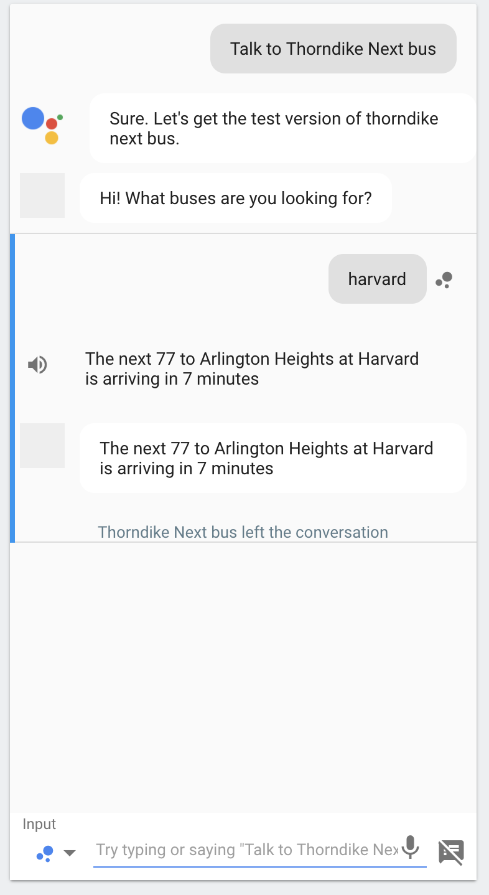

The use of various voice-activated home assistants in everyday life has been booming lately. It started off with Siri, and Google followed with their Assistant. Alexa came on the scene and even Cortana has given it a go.

These assistants come with a good set of features and functions that help you automate your life: setting timers, playing music, turning on and off lights, setting thermostats, etc. It's all very helpful! However, regardless of how many functions exist, there's never going to be a one-size-fits-all solution.

So it's time to make one.

_Play along by following what I have so far in [Github][gh]_

## A bus tracking app

My typical morning involves the usual things: waking up, checking Twitter while laying in bed for 20 minutes, rushing through breakfast/shower/dressing myself to get out the door on time. A part of this involves halting the whole process as I fiddle with my phone to bring up predictions from a bus tracking app ([Nextbus][nextbus] in this case). It would be so much easier if I could instead ask my phone (or Google Home) for the latest buses by my house as I'm toasting a bagel or tying my shoes.

To start, I built a quick function that interfaces with Nextbus' API. It accepts a stop name, and returns an object that has the prediction data that I need:

```javascript
// Nextbus needs a stopId to look up predictions
// We have an object that maps stopNames to stopIds
const stops = {
  'harvard':'55555'
  // other stops here...
}

exports.getPredictions = stopName => {
  const stopId = stops[stopName];

  const nextbusURL = `http://webservices.nextbus.com/service/publicXMLFeed?command=predictions&a=mbta&stopId=${stopId}`;

  // The Nextbus API is an XML api, so we use the xml2js package
  // to convert that to JSON
  // Then we have a parseSchedule function to clean up that
  // JSON, only returning the results we want
  return request(nextbusURL)
    .then(xml => xml2js(xml))
    .then(json => parseSchedule(json))
}

const parseSchedule = json => {
  const cleanedUp = [];
  
  // Take `json` and extract only the info we care about
  // In the end, cleanedUp will be a multidimensional array of sentences, like:
  // [
  //   ['The next 77 to Arlington Heights at Harvard is arriving in 5 minutes'],
  //   ['The next 96 to Medford Square at Harvard is arriving in 8 minutes']
  // ]

  return cleanedUp;
}
```

_If you're following in the [Github repo][gh], you'll notice that I'm only getting the first prediction for each route/direction combo. Shuffling around this function a bit and we can get multiple sets of predictions per route, which we can append to the inner array_

## Making sentences - `filter` and `join`

Before we can send this data to any voice assistant, we need to make actual, speakable sentences. 

The `cleanedUp` object from `parseSchedule` is a multi-dimensional array. The first dimension is a set of routes (bus numbers) and the second is the set of predictions for that route. Since these are in an array, we can use some of the new ES6 functions to parse this out into a set of sentences for each route.

Note: That routes with no predictions will show up as empty arrays, so we have to `filter` to get them out. Predictions with no value will show up as empty strings, and we can filter those out as well (even using the same `length` check for both!)

In the actual repo, I have this set up as a one-liner, but it's expanded/annotated below:

```javascript
exports.stringifyPredictions = (results, joiner = ". ") => {
  let resultsMessage = results.map(predictionList => {

    // predicitonList is a set of predictions for a route
    // Filter out the empty ones (empty strings), then join them together
    return predictionList.filter(l => l.length > 0).join(joiner)
  })

  // Filter and join again on the set of routes
  // Filtering out empty routes (which show up here as empty arrays)
  resultsMessage = resultsMessage.filter(l => l.length > 0).join(joiner);

  return resultsMessage;
}
```

## Make it web-accessible

In order to work, Google Assistant must be able to access our service over the web, where we will return what we want it to say as a JSON response. I use [Express][express] to set up a server to listen to queries from Google, and host on Heroku. 

```javascript
const app = express();
app.post('/thorndike', (req, res) => {

  // See below for the contents of googleAction.js
  require('./googleAction')(req, res);
});
```

## Conversing with Google Assistant - Actions on Google and DialogFlow

Now that we have functions for getting prediction sentences, we need to hook up Google Assistant to respond to our voice, and reach out to our service to get the set of predictions. For that we use the [`actions-on-google`][aog] module from `npm` as well as [Dialogflow][df].

Before getting into code, we need to set up our app on the Google Developer Console and Dialogflow. Dialogflow is the glue between Google Assistant and our app, it receives the parsed voice input from Google Assistant, and will call our app via webhook (they call it a "Fulfillment") in response. [I used this bit of documentation to get all of this set up][tut]. It goes over some of the concepts of a Google Assistant "conversation" as well has walking through the Dialogflow web console.

Part of said setup is making an "Action" that the service can respond to. This can be any sort of string that identifies what's happening; we just need to remember is when we get to coding up our response. Another important part is the "argument," which is a piece of the spoken phrase that can be variable. We can extract that text and use that to inform which bus we are looking for. E.g. "Hey Google, What buses are near __Harvard__?" Both of these will get sent to our request handler, which is the next bit of code we will be working on!

## Responding to requests with `actions-on-google`

The [`actions-on-google` module][aog] works by parsing the request received from Google Assistant/Dialog flow, and calling a function based on what action was sent. This is done by setting up a Map that connects action strings to functions. From there we just have to call `getPredictions`/`stringifyPredictions` to get our prediction sentences, and then pass that into a `tell` function that `actions-on-google` gives us!

```javascript
// googleAction.js

const App = require('actions-on-google').DialogflowApp;
const { getPredictions, stringifyPredictions } = require('./getPredictions');

// This is the action we set up in DialogFlow
const ASK_ACTION = 'ask_stop_by_name';

// We set up a parameter called stop_name, that is filled in
// when the voice input is parsed.
const STOP_NAME_ARGUMENT = 'stop_name';

module.exports = (request, response) => {
  const app = new App({request, response});

  let actionMap = new Map();
  actionMap.set(ASK_ACTION, app => {

    // getArgument() is a function from 
    // `actions-on-google` / `DialogflowApp` that can parse
    // out the argument from the voice input.
    let stopName = app.getArgument(STOP_NAME_ARGUMENT);

    getPredictions(stopName)
      .then(results => stringifyPredictions(results))
      .then(resultsMessage => {

        // stringifyPredictions returns 'false' if a stop exists, but has no buses.
        if (resultsMessage === false) {

          // app.tell literally makes Google Assistant speak!
          app.tell(`There don't seem to be any buses at ${stopName}`);
        }

        // any other falsy value means that the app doesn't know about that stop
        else if (!resultsMessage) {
          app.tell(`Sorry, I don't have information for ${stopName}`);
        }
        
        // We got some predictions!
        else {
          app.tell(resultsMessage);
        }
      });
  });

  // The App, built based on the request/response we received,
  // will take in our map, figure out the action based
  // on what Dialogflow sent us, and then call the
  // relevant function.
  app.handleRequest(actionMap);
}
```

## Talking with Google Assistant

Now that we have our web app set up (and hosted, and the webhook is put into Dialogflow), we can start talking to our new Google Assistant app! There are just a few things to set up that will make talking to Google just a bit nicer.

### Rename your app

When setting up Dialogflow, it created an app in the [Actions on Google Console][aogconsole]. We can log in here and update the App information, like the app name and pronunciation, so we can talk to our service by name. I called mine "Thorndike Next Bus" (more on naming in a bit).

This screen is meant for putting in your app metadata for publishing on the Google Actions Marketplace for everyone to use. However I currently don't have plans for a general public release of this; I just want to use it on my account. But since we are effectively preparing a public app (just not releasing it), we have a few limitations.

- There are a number of required fields that don't apply, mostly related to marketing imagery and copy. You can leave these blank, and your info will save, however you'll get warnings everytime you return to make an update
- Since this is meant for a public release, the name of your app has to be unique (and also not related to an established brand, as Google will prompt you to prove that you are working on behalf of that brand, which you probably aren't). This means that your app's name might have to be an awkward phrase instead of a single word.
- Since we aren't "releasing" our Google Assistant app, she will constantly tell us that we are using the "test version" of our app. Oh well.

### Testing in the browser

Once you edit your app information, you can test out the responses in your browser by clicking "Test Draft". You'll get a screen that looks like the Google Assisant Android screen on the left, and various data about your tests on the right. Here, you can type in your expected voice input and see how Google Assistant responds.

<p style="text-align:center">
<br/>
<em>Success!</em>
</p>

### Testing with your voice

Now that everything is deployed, you can actually talk with Google Assistant (as long as you are logged in to the same Google account as you made the app on) and follow a similar conversation as you saw above. Just say "Hey Google, Talk to <YOUR\_APP\_NAME>" and you're ready to go.

### Feels clunky? Yeah, it kind of is.

The was Actions on Google works is through a concept of "conversations." Which is great for talking to an AI. However the fact that you have to retrieve a second "assistant" to get the information (instead of the info coming from Google Assistant herself) feels like a hiccup in the process. In the end, it adds an extra call/response to a procedure that could be shortened "Hey Google, get predictions for X bus." Going the "conversation" route is a bit longer, but it has the benefit of being completely hands-free.

## The Future

This way of augmenting Google Assistant is fantastic for setting up conversations with AI to interact with data sources that don't come "standard" with it. Just takes a bit of work to mold the data into a sentence, and then serve a response when Google comes knocking on your server with some voice input. However, sometimes these conversations can be clunky just to get a bit of data. If only there were an alternative way to get the data, with a single sentence or even the press of a button&hellip;

__Oh wait there is!__ In a followup article, I'll be hooking up the same bus tracking app to [IFTTT's Google Assistant integration][ifttt], which will allow us to access our data in a number of different alternative ways to Google's conversations. 

[nextbus]: https://nextbus.com
[express]: https://expressjs.com
[aog]: https://www.npmjs.com/package/actions-on-google
[df]: https://dialogflow.com
[tut]: https://developers.google.com/actions/dialogflow/first-app
[aogconsole]: https://console.actions.google.com/
[ifttt]: https://ifttt.com/google_assistant
[gh]: https://github.com/washingtonsteven/thorndike